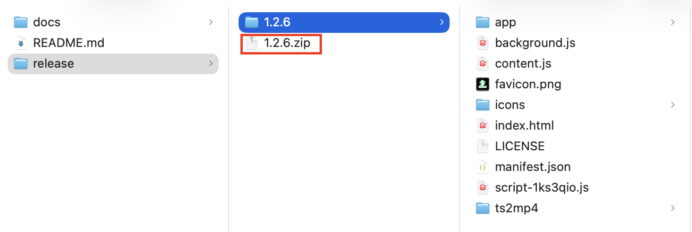
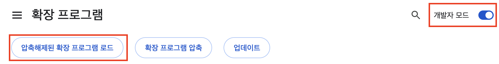
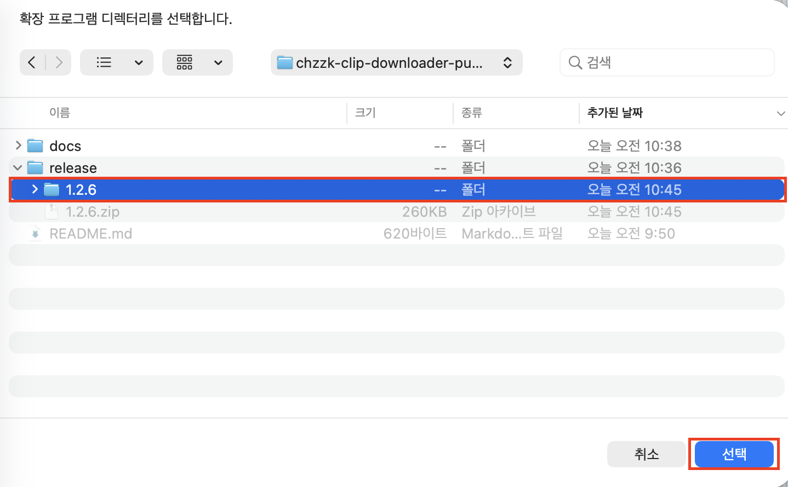
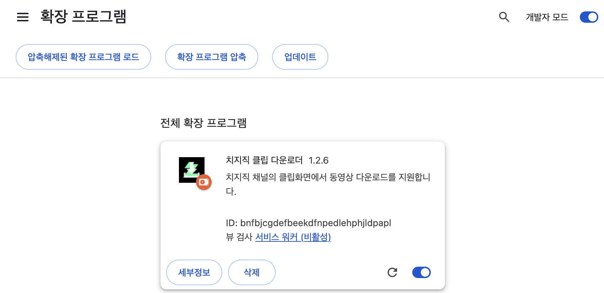
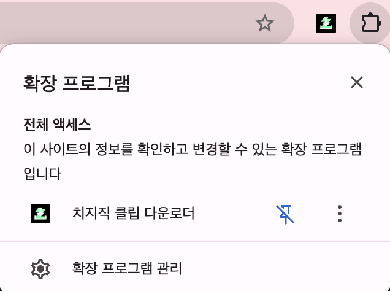
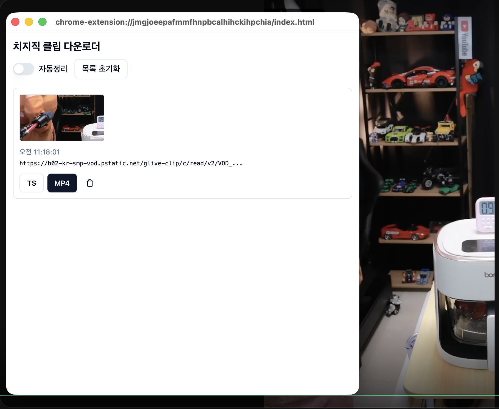
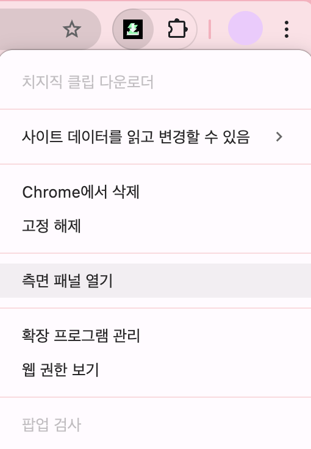
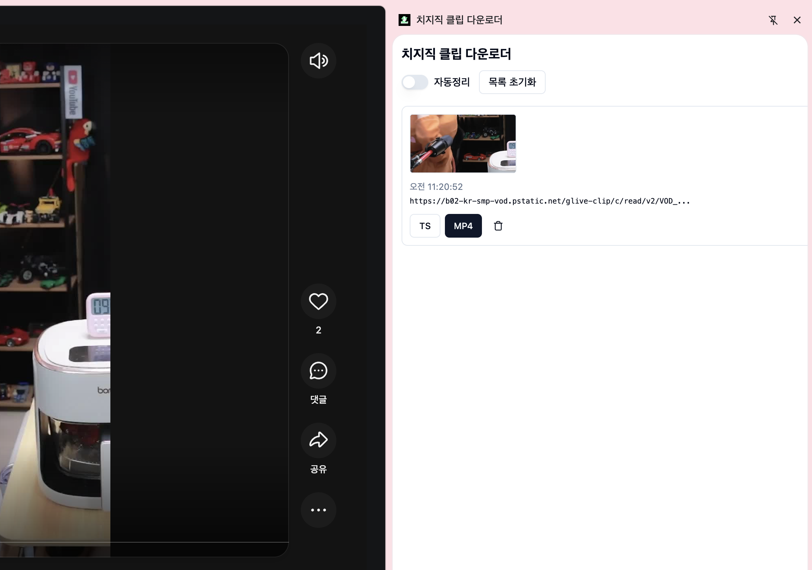

# 치지직 클립 다운로더

크롬익스텐션 배포 및 아카이빙을 위한 레파지토리입니다.

[검수 대기중: Chrome Web Store](./)

## 릴리즈 버전

| 버전 | 다운로드 | checksum |
| - | - | - |
| 1.2.8 | [💾](https://raw.githubusercontent.com/media-processor/chzzk-clip-downloader/refs/heads/main/release/1.2.8.zip) | sha256:670654872922f5aa25d778b517c481e976febb1bea8c231a7c68e9405655403c |

## 릴리즈 버전 설치 방법

1. [릴리즈 버전 다운로드](https://raw.githubusercontent.com/media-processor/chzzk-clip-downloader/refs/heads/main/release/1.2.8.zip)

2. 압축 해제

3. [확장프로그램 페이지 (chrome://extensions) 접속](chrome://extensions)
4. 우측 상단 `개발자모드` 활성화

5. `압축해제된 확장 프로그램 로드` 버튼 클릭

6. 압축 해제한 익스텐션 디렉터리 선택

7. `전체 확장 프로그램` 목록에 보이면 설치완료

## 사용방법

1. 우측상단 익스텐션 아이콘 클릭 후 확장프로그램 고정

2. [치지직 클립 페이지](https://chzzk.naver.com/clips) 접속 후 마음에 드는 클립 클릭

3. 우측 상단에 고정시킨 `치지직 클립 다운로더` 클릭

**팝업 사용예시:**

**사이드패널 사용예시:**

> 우측 상단에 고정시킨 `치지직 클립 다운로더` 마우스 오른쪽 버튼 클릭

4. TS, MP4 버튼 클릭하여 다운로드
