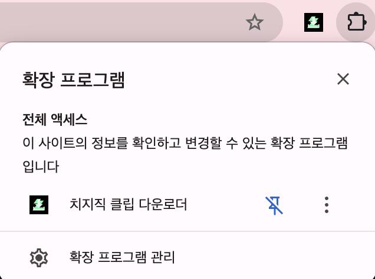
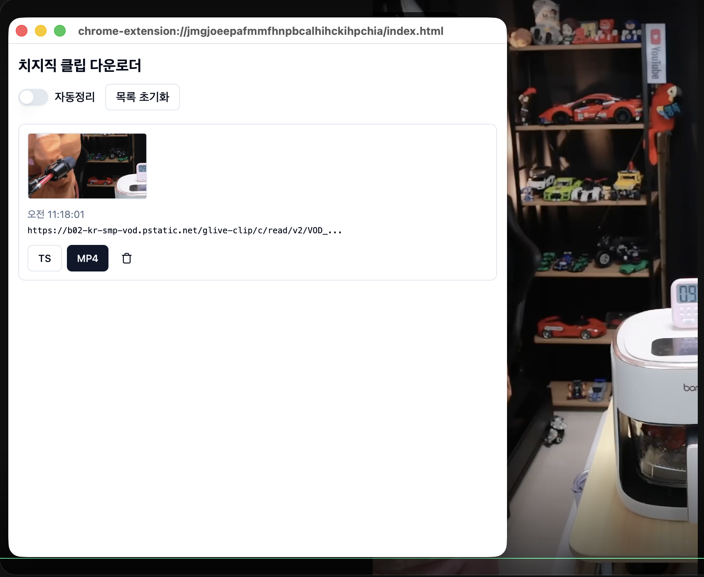
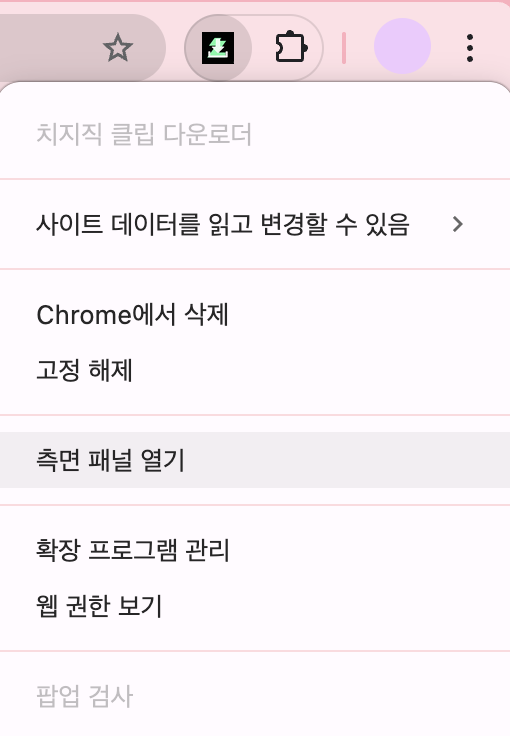
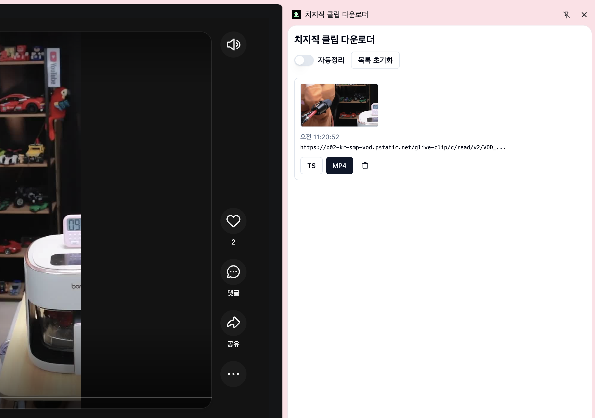

# 치지직 클립 다운로더

크롬익스텐션 배포 및 아카이빙을 위한 레파지토리입니다.

## Chrome Web Store

[Chrome Web Store](https://chromewebstore.google.com/detail/gkblidmkgpdljmiaapdlnmogmhfcidee?utm_source=item-share-cb)

## 사용방법

1. 우측상단 익스텐션 아이콘 클릭 후 확장프로그램 고정

2. [치지직 클립 페이지](https://chzzk.naver.com/clips) 접속 후 마음에 드는 클립 클릭

3. 우측 상단에 고정시킨 `치지직 클립 다운로더` 클릭

**팝업 사용예시:**

**사이드패널 사용예시:**

> 우측 상단에 고정시킨 `치지직 클립 다운로더` 마우스 오른쪽 버튼 클릭

4. TS, MP4 버튼 클릭하여 다운로드
